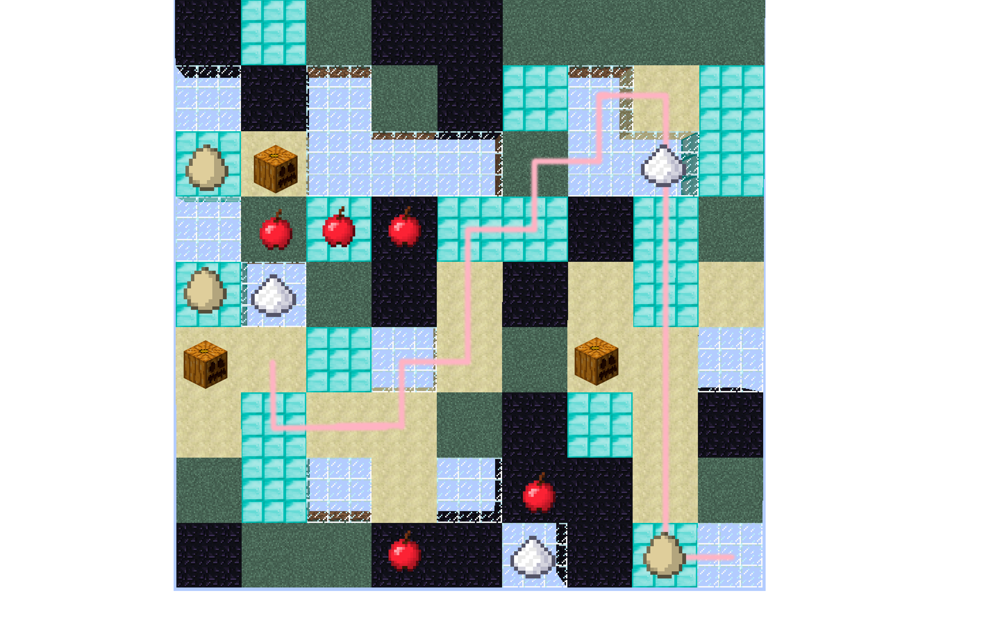

## Video
<iframe width="560" height="315" src="https://www.youtube.com/embed/lLSKd205U9M" frameborder="0" allowfullscreen></iframe>

<h2> Project Summary </h2>

<h3> Description </h3>
Our agent is designed to learn about corresponding relationship between terrain blocks and objects on it, and it will apply what it has learnt in a more complex map to find objects it is asked for. It is like an auto-robot for searching required objects in places that human cannot reach, such as deep forest or seafloor. It will optimize its path while it is searching. 
In such condition, sometimes it is hard to connect to the robot wirelessly or send commands in time. It will be more reasonable to let robot handle itself and report regularly. 

Therefore, we will use what we have here to apply to future environment. We simulate this on a simple training map with objects on it. 
Most objects are bind onto a certain type of block, but there are outliers just to confuse our agent. Expect some unexpected. 
Then the agent will take what it has learnt and apply to the test map, which is more like a real-life situation. 

## Approaches

<h4>Training Map:</h4>

Here we use the recipe for pumpkin pie as an example. To craft a pumpkin pie, we need egg, sugar, and a pumpkin. On the training map, eggs are created on Diamond_block, apples on grass, sugar on glass, and pumpkins on sandstone. However, there are cookies and cooked fish as outliers on random position on the map. Out agent will traverse the training map to learn about this policy. As it learns, it will know to find apples on grass first and so as other relationships. It will bring what it has learnt to the test map. 
Relative relationship: 
"egg" on "diamond_block" 
"apple" on "grass"
"sugar" on "glass"
"pumpkin" on "sandstone"
"apple" on "obsidian"

<h4>Test Map</h4>
After that, our agent is put at the right corner on a randomly generated test map, which is a 27 by 27 map concluding 81 groups of different blocks, and not every block has its assigned objects. Obsidian and apple are considered outliers here. 
The agent is using A-star search to evaluate four steps ahead of its current location, and return a potentially best direction. The agent ranks those blocks on various standards, including the worthy status of this block (visited, unvisited but not valuable, and potentially valuable) and the path of this block (how many steps have to be made to move to this block). The challenging part is that the priority changes as every step it takes and items it finds. For example, if we are looking for pumpkin, we will look for sandstones. All sandstones are potentially valuable to us untill one pumpkin is found, and then all sandstone are treated as unvisited but not valuable blocks, which means lower rank. All blocks are important to us in the first place, but they get less valuable as the agent travels. However, the visited blocks are not forbidden because there are chances that the agent has to pass through it to get to another potentially valuable block. Therefore, we give different scores to those situation carefully. In addition to that, visted blocks tend to be less and less possible to take. 

## Evaluation

<h4>Raw Data</h4>
We also write agents via different algorithm in order to compare with ours. 
Here is table. 

<h4>Random</h4>

First is a random	agent that takes directions randomly. Here is a list of 10 attemps that the agent finishes finding all three objects.

[521, 61, 146, 38, 36, 439, 143, 240, 29, 93]

The maximum step is 521 and the minimum is 29. The average is 174.6 with a standard deviation of 165.72. SD is very large because this totally depends on luck. 

<h4>DFS</h4>
DFS is using depth-first search to traverse the map. Here is a list of 10 attemps that the agent finishes finding all three objects. 

[42, 14, 68, 67, 16, 69, 82, 55, 70, 42, 69]

The maximum step is 82 and the minimum is 14. The average is 54.0 with a standard deviation of 21.71. SD is reduced a lot and average is 1/3 of the random agent. 

<h4>A* (Ours)</h4>
We implement A* search with our ranking system to dynamically decide which direction to take. 

[12, 14, 6, 14, 24, 22, 26, 22, 20, 19]

The maximum step is 26 and the minimum is 6. The average is 17.9 with a standard deviation of 5.906. 
SD and average is further reduced to a decent number. 

## References

