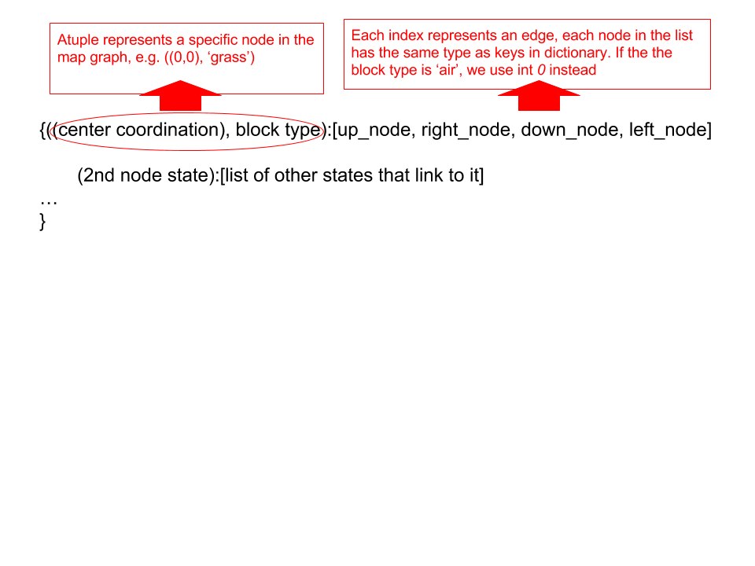
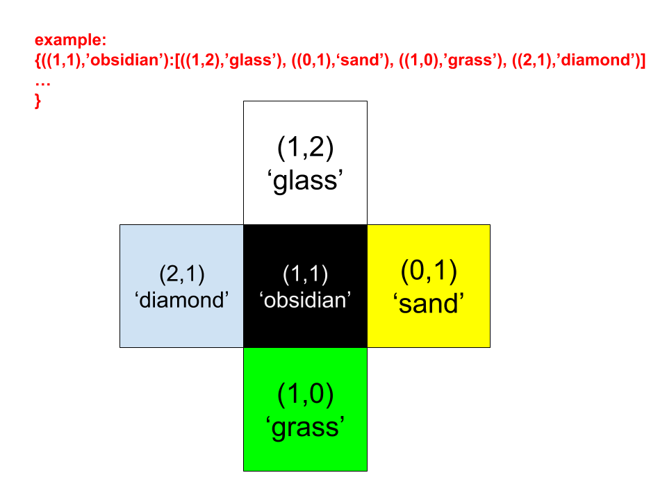
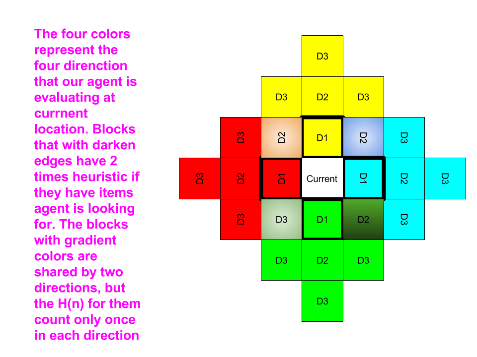
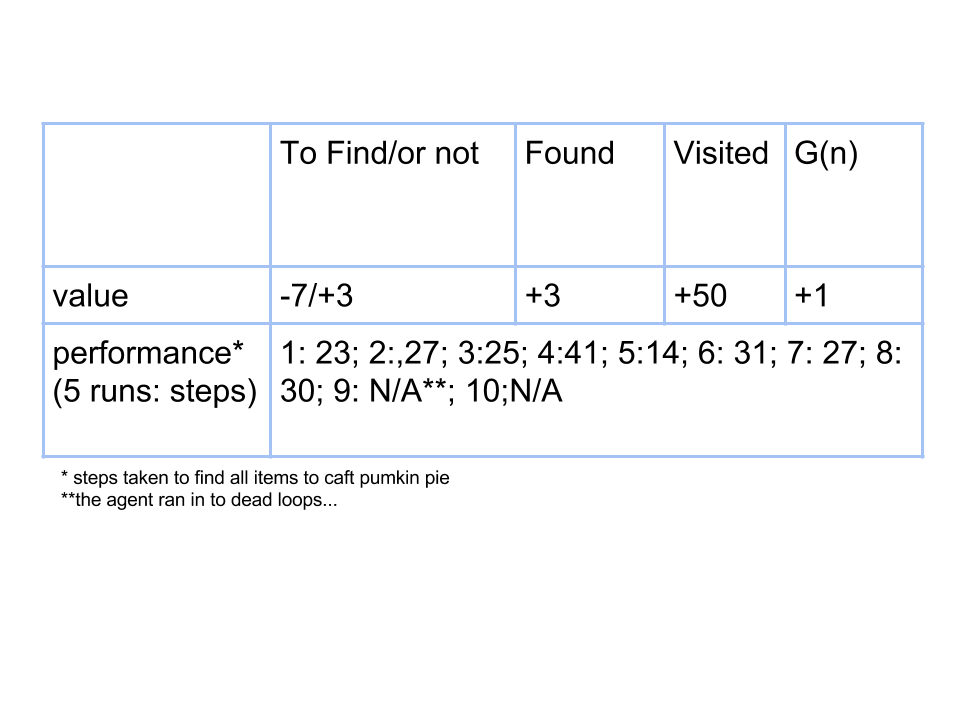
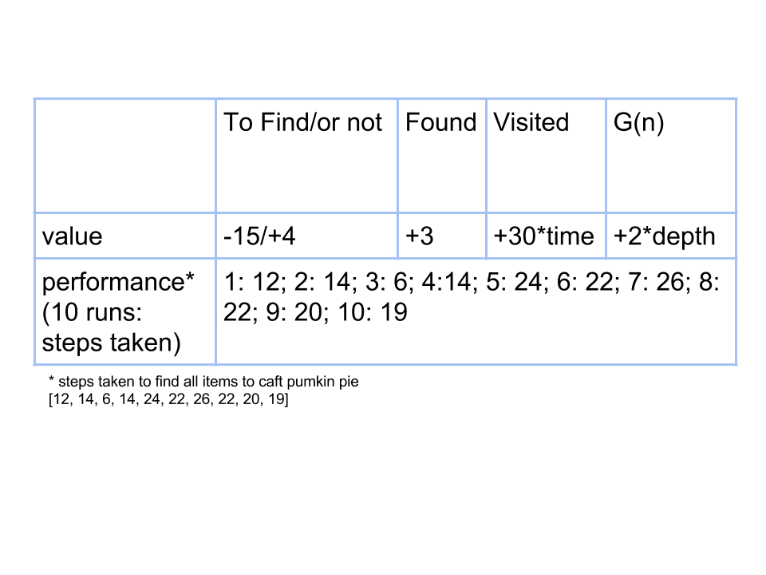

## Video
<iframe width="560" height="315" src="https://www.youtube.com/embed/lLSKd205U9M" frameborder="0" allowfullscreen></iframe>

<h2> Project Summary </h2>

<h3> Description </h3>
Our agent is designed to learn about corresponding relationship between terrain blocks and objects on it, and it will apply what it has learnt in a more complex map to find objects it is asked for. It is like an auto-robot for searching required objects in places that human cannot reach, such as deep forest or seafloor. It will optimize its path while it is searching. 
In such condition, sometimes it is hard to connect to the robot wirelessly or send commands in time. It will be more reasonable to let robot handle itself and report regularly. 

Therefore, we will use what we have here to apply to future environment. We simulate this on a simple training map with objects on it. 
Most objects are bind onto a certain type of block, but there are outliers just to confuse our agent. Expect some unexpected. 
Then the agent will take what it has learnt and apply to the test map, which is more like a real-life situation. 

## Approaches

<h4>Part1: Training map set up and training algorithm</h4>
<h5>Training Map</h5>
Here we use the recipe for pumpkin pie as an example. To craft a pumpkin pie, we need egg, sugar, and a pumpkin. On the training map, eggs are created on Diamond_block, apples on grass, sugar on glass, and pumpkins on sandstone. However, there are cookies and cooked fish as outliers on random position on the map. Out agent will traverse the training map to learn about this policy. As it learns, it will know to find apples on grass first and so as other relationships. It will bring what it has learnt to the test map. 
Relative relationship: 
"egg" on "diamond_block" 
"apple" on "grass"
"sugar" on "glass"
"pumpkin" on "sandstone"
"apple" on "obsidian"

<h5>Training Map Traverse Algorithm</h5>
For the searching part, we use depth-first search. With a stack of actions recording the last action, the agent can correctly trace back to the last state if it runs into a dead end. If it meets a dead end, the agent will break the loop, pop this current action off the stack, and push back in a new direction/action. On the other hand, the agent itself has a list of lists of 1’s and 0’s as it travels through the map. 1 and 0 are for accessibility of a block, and the coordinates of that block are the relative position in this list, for example, L[0][4] stands for the (1, 5) on map. 
The agent will auto-collect objects from 9 blocks around it. The agent searches via depth-first search. It will check if that block is visited or available. The agent will only take blocks that are un-visited and not causing death, such as lava and air. When the agent is traveling through the map, it collects objects and records on which blocks they are found. Therefore, it will have a dictionary that looks like {(“apple”, “grass”): 64, (“apple”, “sandstone”): 34, (“apple”, “glass”): 2}. The values mean how many times such object is found on this block, so we can conclude the chance to find apples on grass is 64/(64+34+2) = 64%, 24% on sandstone, and 2% on glass. In a test map, we will have a ranking system to evaluate every block of the map. Those blocks are rated based on three elements: how many objects and how often those objects can be found on this kind of terrain, and distance towards agent. For example, with same distance, grass will have higher rank than the other two. However, if there is a pumpkin with {(“pumpkin”, “diamond”): 40, (“pumpkin”, “sandstone”): 30, (“pumpkin”, “diamond”): 10}, and the agent will consider to visit sandstone first because two objects are likely to be found on sandstone instead of visiting grass for apple and diamond for pumpkin.

<h5>Test Map</h5>
After that, our agent is put at the right corner on a randomly generated test map, which is a 27 by 27 map concluding 81 groups of different blocks, and not every block has its assigned objects. Obsidian and apple are considered outliers here. 
The agent is using A-star search to evaluate four steps ahead of its current location, and return a potentially best direction. The agent ranks those blocks on various standards, including the worthy status of this block (visited, unvisited but not valuable, and potentially valuable) and the path of this block (how many steps have to be made to move to this block). The challenging part is that the priority changes as every step it takes and items it finds. For example, if we are looking for pumpkin, we will look for sandstones. All sandstones are potentially valuable to us untill one pumpkin is found, and then all sandstone are treated as unvisited but not valuable blocks, which means lower rank. All blocks are important to us in the first place, but they get less valuable as the agent travels. However, the visited blocks are not forbidden because there are chances that the agent has to pass through it to get to another potentially valuable block. Therefore, we give different scores to those situation carefully. In addition to that, visted blocks tend to be less and less possible to take. 

This is rather a extreme case. The agent will firstly look for everything but grass or obsidian, so it misses the sugar among three obsidian blocks on the left of the begining point. Thereafter, it goes left then all the way up because those blocks are more "promising". At where sugar is found, agent's path begins to avoid glass as well. At (6,4), the agent decides to pass glass rather than grass because visited is still a better path than not valuable. Finally, it reaches three sandtones, and finds pumpkin on one of them. 

#### Part 2: Testing map set up and Searching algorithm on test map ####
1. Graph construction
We first construct a graph representation from the test map mentioned above. The graph representation is like this

2. A-star heuristic search algorithm
the formular of A-star search is this: 
### F(n) = G(n) + H(n) ###
  - *For G(n)*: Since every block placed next to each other, so the edge weight is just 1, which means that G(n) is als 1 for each depth
  - *For H(n)*: We decided to use 3-depth heuristic cost evaluation: for each of the four possible direction our agent can make, it evaluates states in 3 steps. For each of these states, we evaluate four aspects:
  - whether the state has item that we are looking for
  - whether the state has item that we already found
  - whether the state has been visited

Also, in order to prevent agent from falling down the sky, we give H(n) = 1000 when it find a near by node state to be 0 (i.e. "air") at depth 1. What's more, for the nodes that next to current node, we give then 2 times heuristic value since they are more important for agent to consider. Now we calculate each state's G(n) and H(n) value, and add them up, which is the F(n) of one direction. Then we find the direction with the lowest F(n) value, and go towards that direction. The image below is a detailed illustration.

- *Specific heuristc values*: We have done a lot of experiments to improve the performance of the agent. The initial values we used and the performance are shown blow in chart.

Along the process of heavily experimenting, we found that the agent has several things can be improved:
1. Add more cost for blocks that already visited: (Times of visit) times (heuristic value for visited)
  - solved dead loop
2. Add heuristic cost to "air" block at depth 2 and 3
  - improved the performace that the agent tends to search towards the boundary
3. Add more rewards (negative cost) to nodes that might have items on it
  - made the agent more "greedy"
4. Increased G(n) at depth 2 and 3
  - made the near by node lower F(n)
  
After a great amount of testing, we ended up with values like this:

Even though the algorithm is not perfect, guarenteed optimal solution, but we are satisfied with this performance considering agents limited sight. Ellaborate more in evaluation section.
## Evaluation

<h4>Raw Data</h4>
We also write agents via different algorithm in order to compare with ours. 
Here is table. 

<h4>Random</h4>

First is a random	agent that takes directions randomly. Here is a list of 10 attemps that the agent finishes finding all three objects.

[521, 61, 146, 38, 36, 439, 143, 240, 29, 93]

The maximum step is 521 and the minimum is 29. The average is 174.6 with a standard deviation of 165.72. SD is very large because this totally depends on luck. 

<h4>DFS</h4>
DFS is using depth-first search to traverse the map. Here is a list of 10 attemps that the agent finishes finding all three objects. 

[42, 14, 68, 67, 16, 69, 82, 55, 70, 42, 69]

The maximum step is 82 and the minimum is 14. The average is 54.0 with a standard deviation of 21.71. SD is reduced a lot and average is 1/3 of the random agent. 

<h4>A* (Ours)</h4>
We implement A* search with our ranking system to dynamically decide which direction to take. 

[12, 14, 6, 14, 24, 22, 26, 22, 20, 19]

The maximum step is 26 and the minimum is 6. The average is 17.9 with a standard deviation of 5.906. 
SD and average is further reduced to a decent number. 

## References
[A-Star search](https://en.wikipedia.org/wiki/A*_search_algorithm)
