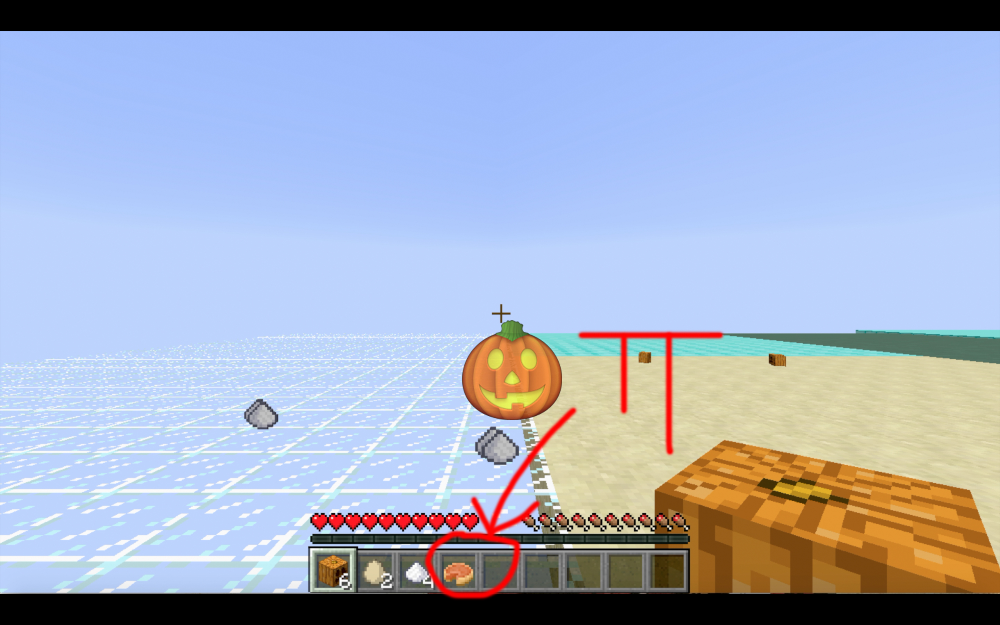

Machine Learning Project in MineCraft

Authors: Chongming Wang, Zeyang Li, Yifan Zhang

<a href="https://github.com/chicomy/CS_175_malmo_project/blob/master/docs/project2.py">Link to Project Source Code</a>
[

<a href="https://youtu.be/lLSKd205U9M">Link to Youtube Video</a>

<a href="https://github.com/chicomy/CS_175_malmo_project/blob/master/PPT.pptx">A Powerpoint file to explain the video</a>

In this project, we designed an agent that can search for given objects in an open map, and craft objects based on recipe after retrieving those materials.

The agent will firstly avoid lava. However, after exploring the whole map, if the agent has not found everything it is asked to, it will use water to pave a path through lava to keep looking.

The agent will dump things that it does not need once in a while.

